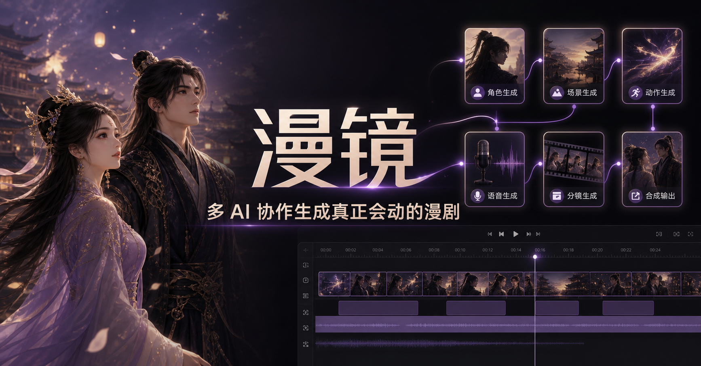
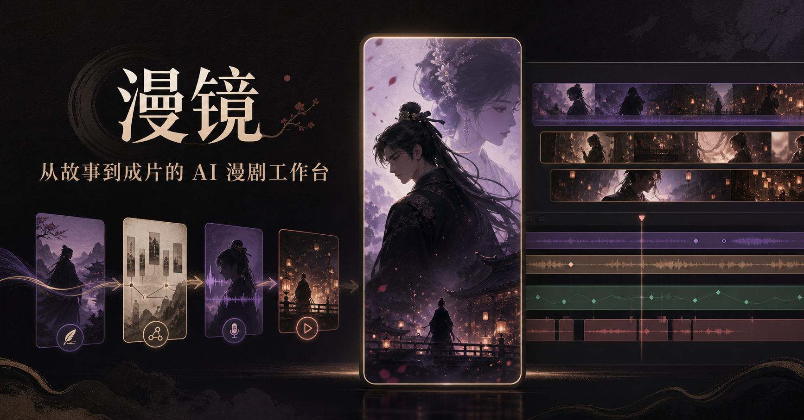

# 漫镜 Manjing

> 面向 AI 漫剧、AI 短剧与系列视频制作的 Windows 桌面工作台。


漫镜把剧本、Agent 团队、长期记忆、技能、角色与场景资产、分镜、视频、配音和剪辑放进同一个项目。用户可以导入整部系列剧本，选择具体剧集制作，并让各岗位 Agent 在项目记忆和 Canonical 标准资产的约束下协同工作。

## 主要功能

### Agent 创作团队

- 总制片、导演、编剧、分镜、镜头总控、生图、视频、配音和剪辑 Agent。
- 每个 Agent 拥有独立聊天、长期记忆和可编辑 Skill。
- 内置 188 个岗位 Skill，并支持导入 `.skill`、`.md`、`.txt`、`.json`、`.yaml`、`.docx` 和 `.pdf`。
- 总制片可以将规则、记忆和技能派送给对应岗位。



### 系列项目与分集制作

- 导入 40 集等长篇总剧本，自动拆分剧集、角色关系、世界规则与时间线。
- 项目、剧集、角色圣经、长期记忆和资产相互隔离。
- AI 工作台支持随时绑定或切换当前项目与剧集。
- 上一集结束状态可以传递给下一集，保持背景故事连续。

### Canonical 资产与连续性引擎

- 人物、造型、场景、道具和声音均可锁定为 Canonical 标准资产。
- 已生成资产按项目和剧本语义命名，并可重复引用、重命名和批量删除。
- 人物、场景、道具、分镜和声音使用稳定复用键；状态完全一致时直接读取原资产并跳过模型调用。
- 台词完全相同时复用原音频；台词变化时仍沿用角色固定音色生成新配音。
- 镜头间传递 Start State / End State，检查人物位置、服装、道具、空间关系和光线。
- 一致性审核只检查当前景别中实际可见的内容，不再因画外场景锚点误判。
- 低于阈值时分析可见偏差并进行一次约束修复。
- 自动修复后仍低于 85 分时先询问用户；只有用户同意才撤销不合格画面并重构，新结果重新质检后写入资产库。



### 图片、视频、声音与剪辑

- 生图 Agent 可生成人物、造型、场景、道具和分镜图。
- 镜头总控 Agent 负责绑定资产、继承镜头状态并编译 Seedance 等视频模型提示词。
- 支持火山方舟 Seedance、OpenAI 兼容接口、Pollinations、Agnes、自定义 Webhook，以及可选本地节点。
- 15 秒以内由 AI 判断是否一镜直出；长视频按剧情节奏拆镜后逐镜生成并剪辑。
- 角色声音资产可复用，配音和背景音乐分别控制。
- 独立字幕总开关同时控制预览、时间轴、编辑器交接和最终成片烧录，不影响配音、原声或背景音乐。

## v1.5.0 性能重构

- 默认 Skill 改为浏览器空闲时异步导入，不阻塞聊天区或工作台首屏。
- Skill 与记忆数据增加内存缓存，避免每次 Agent 调用都重复解析大型本地数据。
- 顶部导航关闭重页面抢先预载，用户点击后只加载当前需要的页面代码。
- 桌面端改为单窗口客户端路由，切页不再创建第二个完整渲染器，降低内存占用并避免整页重载中断请求。
- 增加统一页面加载状态，切换过程中保持明确反馈。
- 生产进度继续使用本地运行快照保存，返回工作台后恢复当前项目和状态。

## 安装

1. 打开 [Releases](https://github.com/Laity1m/manjing-desktop/releases/latest)。
2. 下载最新的 Windows x64 `.exe` 安装包。
3. 安装并打开漫镜，在“模型中心”或 AI 工作台配置自己的模型接口。
4. 从“项目”导入总剧本，或直接进入 AI 工作台开始制作。

## Seedance 2.0 接入

- API Key：填写火山方舟 `ARK_API_KEY`。
- 模型 ID：填写已开通的 Seedance 模型或 Endpoint ID。
- 创建任务、查询任务和下载结果使用方舟原生异步接口。
- 创建请求不会盲目重试，避免重复任务和重复扣费；查询与下载支持安全重试。
- 分辨率默认使用 `720p`，并记住用户上次选择。

## 数据与隐私

- 项目、聊天、技能、记忆和资产默认保存在用户本机。
- API Key 仅用于用户主动配置的模型服务。
- Secret Key 不写入长期配置；企业资产授权由用户自己的火山账号完成。
- 第三方模型可能产生费用，请以服务商控制台和计费规则为准。

## 开发

```bash
npm install
npm run dev
```

生产构建：

```bash
npm run build
npm run dist --prefix windows-app
```

## UI 开源参考

- [Motion Primitives](https://github.com/ibelick/motion-primitives)：克制的状态与入场动效思路，MIT License。
- [shadcn/ui](https://github.com/shadcn-ui/ui)：按钮层级、可访问状态和响应式布局参考，MIT License。

## 反馈

- [提交 Issue](https://github.com/Laity1m/manjing-desktop/issues)
- [查看 Releases](https://github.com/Laity1m/manjing-desktop/releases)

## 原生视频优先与跨镜头一致性

- Seedance、Agnes 与自定义原生视频接口不再强制先生成分镜图，而是按镜头直接生成视频。
- 每个视频完成后自动提取中间关键帧与镜尾连续帧；镜尾帧和 End State 会传递给下一镜作为起始约束。
- 镜头总控绑定 Canonical 人物、服装、场景和道具，并约束人物左右位置、景深层级、朝向、手持物与光线方向。
- 单个镜头失败时会记录错误并继续生成后续镜头，不再让整部作品停在第一段视频。
- 旁白、广告声、系统播报和画外音只进入声音流程，不生成无意义的人物信息图。
- 资产库提供常驻批量管理工具条，可全选当前筛选结果并批量删除。

一致性工作流参考了 [ConsisID](https://github.com/PKU-YuanGroup/ConsisID)、[StableAnimator](https://github.com/Francis-Rings/StableAnimator)、[StoryDiffusion](https://github.com/HVision-NKU/StoryDiffusion) 与 [ViMax](https://github.com/HKUDS/ViMax) 的身份保持、姿态控制、跨镜头注意力和首尾帧衔接思路。漫镜实现的是模型无关的工作流层，可继续使用用户自己的视频模型接口。
