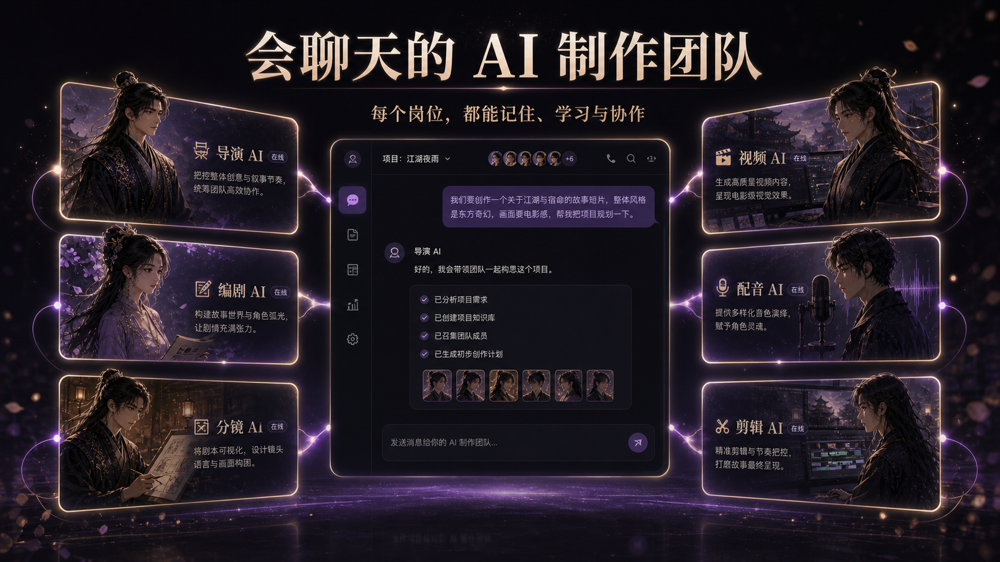
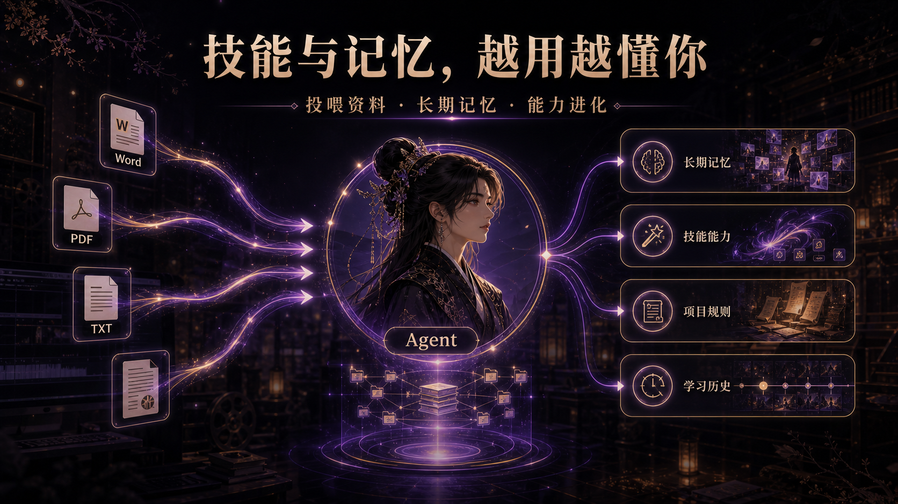
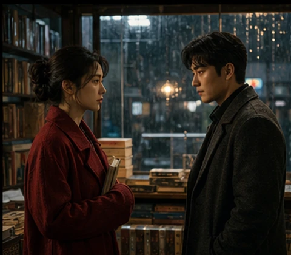
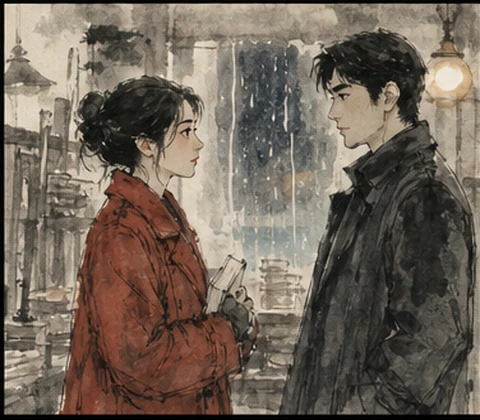
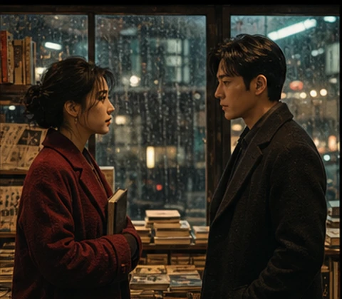
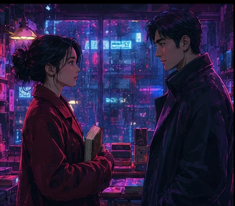
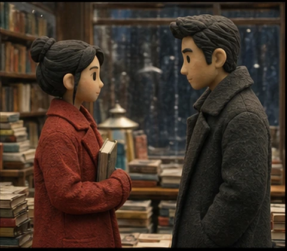

# 漫镜 Manjing

<p align="center">
  <strong>从一个故事，到一支能长期协作的 AI 制作团队</strong><br />
  Agent 对话 · 长期记忆 · 技能学习 · 剧本 · 分镜 · 图片 · 视频 · 配音 · 剪辑
</p>


漫镜是一套面向 AI 漫剧、AI 短剧和视频创作者的 Windows 桌面工作台。它把可对话 Agent、长期记忆、岗位技能、故事创作、角色设定、智能分镜、图片与视频生成、配音、资产管理和剪辑交付放进同一个项目。

用户不需要在多个网站之间反复搬运素材。每个岗位 Agent 都有自己的职责、聊天记录、记忆和技能，并能把学习成果真正带回工作区使用。

## 产品界面


## 一支可以聊天和学习的 Agent 团队



漫镜把创作岗位设计成独立 Agent，而不是一组互不关联的生成按钮。

| Agent | 主要职责 |
| --- | --- |
| 编剧 Agent | 理解故事、设计剧情节拍、对白和人物关系 |
| 导演 Agent | 复核叙事、镜头数量、节奏、时长与视觉一致性 |
| 画面 Agent | 生成角色设定、场景关键帧和一致性画面 |
| 视频 Agent | 调用 Seedance、Agnes 或自定义视频模型生成动态镜头 |
| 配音 Agent | 规划角色声音、情绪表达、对白与音轨 |
| 剪辑 Agent | 组织镜头、字幕、声音、转场并形成最终成片 |

每个 Agent 都拥有三个相互连接的区域：

- **聊天区**：向岗位说明目标、反馈结果、传授经验。
- **工作区**：执行剧本、分镜、生图、视频、配音和剪辑任务。
- **技能与记忆区**：查看、预览、重命名、编辑或删除 Agent 学到的内容。

## 长期记忆与技能学习



- 每个 Agent 拥有独立长期记忆，保存用户偏好、项目规则和确认过的经验。
- 内置不同岗位的预设技能，让 Agent 初次使用时不再像“空白婴儿”。
- 支持导入 `.skill`、Markdown、TXT、JSON、YAML、Word 和 PDF 等资料。
- 技能以完整卡片展示，支持预览、重命名、编辑和删除。
- 用户可以把聊天中的有效方法保存为记忆或技能。
- 学习内容会自动同步到对应岗位，并在后续工作中调用。
- 本地学习记录保留来源和所属 Agent，用户始终拥有控制权。

## AI 智能分镜与视频时长

漫镜会根据目标时长选择不同策略：

- 目标时长不超过 15 秒时，一镜直出，不机械拆镜。
- 超过 15 秒时，由编剧 Agent 和导演 Agent 分析剧情节拍、场景变化、动作复杂度与情绪节奏。
- Agent 自主决定镜头数量以及每个镜头的时长，镜头之间可以等长，也可以不等长。
- 单个 AI 视频片段不超过 15 秒，全部镜头总时长严格匹配用户设置。
- 用户导入的完整分镜可以作为制作起点，已有素材不会重复生成。

## Agnes 与视频模型接入

AI 工作台的视频岗位和独立 AI 视频页面都支持 Agnes Video。

```text
接口地址：https://apihub.agnes-ai.com/v1
模型 ID：agnes-video-v2.0
鉴权方式：Bearer API Key
适配方式：自定义 Webhook
```

漫镜按照 Agnes 官方异步任务流程创建任务、读取 `video_id`、轮询状态并在桌面运行时下载成片。当前适配还包括：

- 读取官方 `metadata.url` 成片地址。
- 为每次生成使用独立随机种子和镜头变体。
- 支持公开分镜参考图的图生视频参数。
- 下载后计算 SHA-256 指纹，识别服务商返回的完全重复视频。
- 检测到重复文件时自动更换参数重建，连续重复则拒绝写入资产库。
- 避免浏览器 CORS 和带鉴权下载导致的 `Failed to fetch` 或 `401`。

同时支持或可扩展：

- 火山方舟 Seedance
- Pollinations
- OpenAI 兼容接口
- Anthropic 兼容接口
- Gemini
- 本地模型
- 自定义 Webhook
- MCP 工具与本地学习流程

第三方模型的参数、额度和价格可能随时变化，请以服务商官方文档和控制台为准。

## 创作流程

```text
故事 / 完整剧本
  -> 编剧与导演 Agent 分析
  -> 角色设定与智能分镜
  -> 关键帧、视频、配音与音乐生成
  -> 素材自动进入资产库
  -> 时间线与画布编排
  -> 字幕、声音、转场与最终成片
```

## 更多视觉风格

| 国漫电影感 | 电影写实 |
| --- | --- |
|  |  |

| 日系动画 | 水墨国风 |
| --- | --- |
|  |  |

| 港风复古 | 赛博朋克 |
| --- | --- |
|  |  |

| 美式漫画 | 黏土定格 |
| --- | --- |
|  |  |

## 核心工作区域

- **Agent 聊天**：选择岗位聊天，将有效结论保存为记忆或技能。
- **AI 工作台**：从故事或剧本开始，组织完整 AI 制作团队。
- **AI 视频**：使用文本、图片、视频和音频参考独立生成视频。
- **学习中心**：搜索资料、本地识别、审核并同步 Agent 学习成果。
- **技能中心**：管理预设技能、用户技能和导入的专业资料。
- **画布**：用节点组织复杂项目、素材与生产步骤。
- **编辑器**：编辑镜头顺序、速度、音量、字幕、转场和时间线。
- **资产库**：统一保存生成的人物、图片、视频、配音和成片。
- **模型中心**：配置 API Key、模型 ID、接口地址和自定义模型。

## 安装与使用

1. 前往 [Releases](https://github.com/Laity1m/manjing-desktop/releases) 下载最新 Windows x64 安装包。
2. 安装新包前彻底退出正在运行的漫镜，避免 Windows 继续使用旧进程。
3. 打开模型中心，为需要的岗位配置 API Key、模型 ID 和接口地址。
4. 新建项目，从 Agent 聊天、AI 工作台或 AI 视频开始创作。
5. 生成素材会进入项目和资产库，可继续送往剪辑器完成成片。

## 当前版本

当前开发版本：`v1.4.5`

主要改进包括 Agent 聊天与长期记忆、岗位技能、技能文件导入、MCP 学习流程、资产自动归档、智能镜头时长，以及 Agnes 视频接口的下载和重复成片保护。

## 数据与隐私

- 项目、Agent 记忆和技能默认保存在本地环境。
- API Key 只用于用户主动配置的模型服务，不会提交到公开仓库。
- 用户可以查看、编辑和删除 Agent 的记忆与技能。
- 第三方模型可能产生费用，使用前请确认服务商规则。
- 请确保导入和生成的素材符合相应授权、隐私和平台规范。

## 反馈

遇到安装、模型接入、视频生成或 Agent 工作流问题，请通过 [GitHub Issues](https://github.com/Laity1m/manjing-desktop/issues) 提交反馈。建议附上漫镜版本、模型名称、接口地址格式和脱敏后的错误信息。
